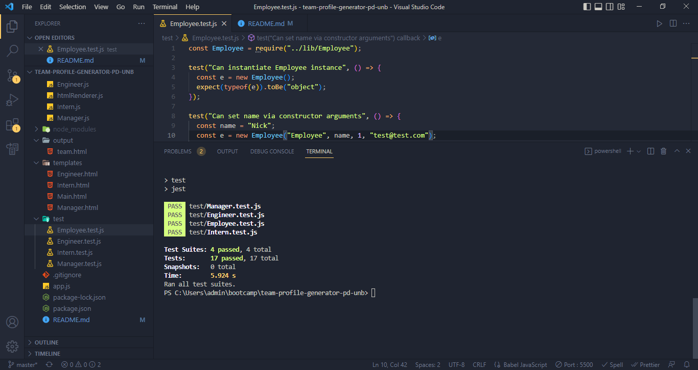

# team-profile-generator-pd-unb

  [](http://badge.fury.io/js/inquirer)
  [](https://opensource.org/licenses/MIT)

## Description
This project required building a Node.js command-line application that takes in information about employees on a software engineering team and generates an HTML webpage that displays summaries for each person. Tests were written for each part of the code using Jest to ensure that it passes all of them.

When prompted for team members and their information, then an HTML is generated that displays a nicely formatted team roster based on user input.

## Table of Contents
- [Description](#description)
- [Installation](#installation)
- [Usage](#usage)
- [License](#license)
- [Tests](#tests)
- [Technology Used](#technology-used)
- [Questions](#questions)

## Installation

To install this application, clone the code into your terminal for the respective repository. Then, install npm by entering the command ```npm init```  into the terminal. Inquirer must then be installed by entering ```npm install inquirer```. Finally, the program can then be run by entering ```node app.js``` into the command line, and answering each question appropriately.

```JavaScript
npm install inquirer
const inquirer = require('inquirer');
 
 
## Usage
Inquirer is easiest to use when installed with npm:  ``` npm install inquirer ```. Then you can load the module into your code with a require call: ``` const inquirer = require("inquirer"); ```
1. Enter management information
2. You will be redirected to a menu, where you can choose to add an engineer, add an intern, or end the application
3. If you choose to add an engineer or an intern, you will be reprompted to the menu until you choose to end the application
4. Once you end the application, your software team will be generated in an HTML file

## License
This application is rendered under MIT

## Tests


## Technology Used
- HTML
- Bootstrap 
- JavaScript
- Node.js
- Inquirer
- Path
- Jest

## Questions
My Github username is Paul-Dimenshion, which can be accessed here https://github.com/Paul-Dimenshion/team-profile-generator-pd-unb.git.

The Github page for this project can be accessed using the following link: https://paul-dimenshion.github.io/team-profile-generator-pd-unb/.

You can reach me at p.demenshyn@gmail.com with additional questions.
  
Below are link to my demo video and the video location on my Github, respectfully: https://paul-dimenshion.github.io/team-profile-generator-pd-unb/
- [Link to Demo Video](https://watch.screencastify.com/v/PJlA5qtqETY7TqN9ZfqT)

Footer
© 2023 GitHub, Inc.
Footer navigation
Terms
Privacy
Security
Status
Docs
Contact GitHub
